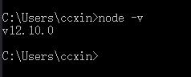

# Node.js 介绍与安装

## 什么是 Node.js

Node.js 是一个基于 Chrome v8 引擎的 JavaScript 运行时环境，让 JavaScript 的执行效率与低端的 C 语言的相近的执行效率，使用了一个事件驱动、非阻塞式 I/O 的模型，使其轻量又高效。

## Node.js 的特点和应用场景

Node.js 是单线程的。
Node.js 使用了事件驱动、非阻塞式 模型，轻量又高效。事件驱动是一种处理数据的方式，这种方式同传统的数据处理方式 CRUD （增加、读取、更新、删除）截然不同 。

事件驱动（ Event Sourcing ）定义了一种由事件驱动的数据处理方式，应用发送的所有事件都会被载入附加存储区，每一个事件都代表了一系列的数据变更。被保留下来的事件会作为操作历史留存下来，与此同时事件流会被不间断地同步到客户端供其使用，例如更新整体的物化视图（ Maerialized View ），把事件流提供给外部系统，或者通过重演与特定物体有关的历史事件来确定它的当前状态等。

事件驱动的异步模型使得 Node.js 非常适合用来处理 I/O 密集型应用，但也不限于此，例如 Web 聊天室（ Socket.io ）、 Web 博客（ Hexo ）、Web 论坛（ Node Club ）、前端模块管理平台（ ower.js ）、浏览器环境工具（ Browserif ）命令行工具（ Commander )等。流行的 Node.js 应用框架有 Express、Koa 等。

Node.js 能够运行在 Linux、macOS、Windows、UNIX 等平台上，并且可以用能够被编译为 JavaScript 的任何语言（包括 CoffeeScriptTypescript 等）进行编写。

## Node.js 安装

1. 先到 http://nodejs.cn/ 上下载适合自己操作系统的最新版本安装包，整个安装过程很简单，和普通软件安装一样，直接下一步即可。

> 安装 Node.js 会默认安装 NPM (Node Package Manager ），即 Node.js 块管理工具

2. 安装完成后在命令行工具内输入 `node -v`，如果安装成功会出现当前 Node.js 版本号的提示，如图：

如果不能检查当前版本时，检查系统环境变量 Path 是否添加了 Node.js 的路径，如果没有则添加上，如图：

